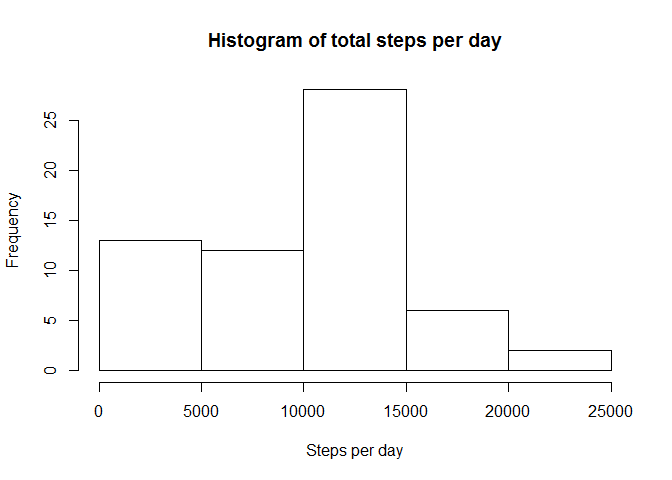
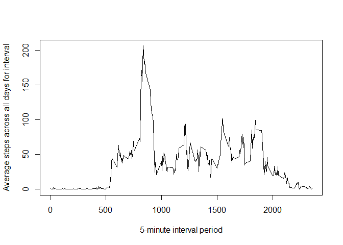
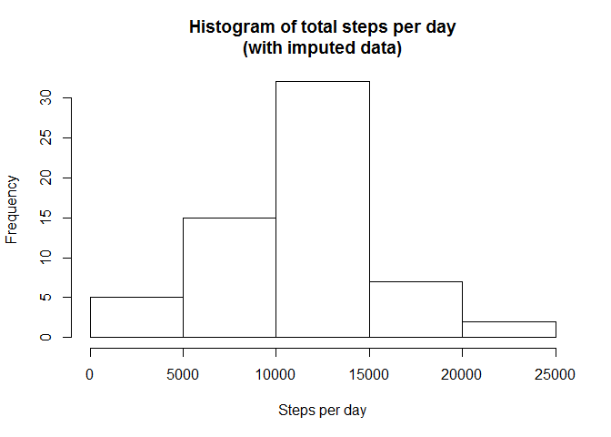
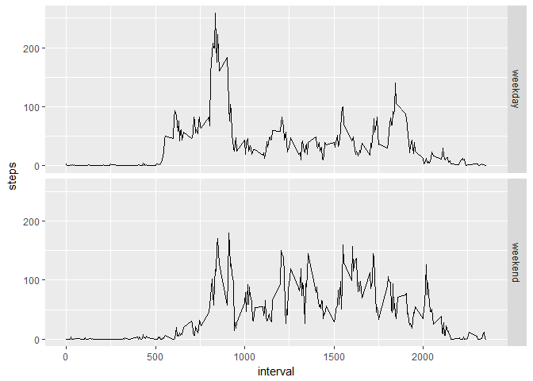

# Reproducible Research Course Project 1
Jeff Holycross  
April 13, 2017  


## Introduction

This is an R Markdown document for the report for Course Project 1 in the Reproducible Research course on Coursera.  This assignment was intended to learn how to use RMarkdown to perform a reproducible analysis on provided data, and provide the analysis in an easily readable format. 

## Data

The data for this assignment can be downloaded from the course web site:

* Dataset: [Activity monitoring data](https://d396qusza40orc.cloudfront.net/repdata%2Fdata%2Factivity.zip) [52K]

The variables included in this dataset are:

* **steps**: Number of steps taking in a 5-minute interval (missing vlues are coded as `NA`)

* **date**: The date on which the measurement was taken in YYYY-MM-DD format

* **interval**: Identifier for the 5-minute interval in which measurement was taken

## Loading and preprocessing the data

This data was loaded from the provided activity.zip file (see Data section above), which included activity.csv.


```r
cp1_activity <- read.csv("activity.csv", colClasses = c("integer","Date","integer"))
```

## What is mean total number of steps taken per day?

The data was processed to find the total number of steps using the tapply function. As directed, missing values were ignored for this analysis. A histogram and summary statistics follow.


```r
## Use tapply to aggregate the steps per day
cp1_stepsPerDay <- with(cp1_activity, tapply(steps, date, sum, na.rm = T))
## Print a histogram
hist(cp1_stepsPerDay, main="Histogram of total steps per day", xlab="Steps per day")
```

<!-- -->

```r
## Print mean & median
message("Mean: ", mean(cp1_stepsPerDay))
```

```
## Mean: 9354.22950819672
```

```r
message("Median: ", median(cp1_stepsPerDay))
```

```
## Median: 10395
```

## What is the average daily activity pattern?

The provided data included both a date and a time interval (the elapsed time since midnight in five minute increments). The data was averaged over every date for a given time interval to analyze the average daily activity pattern.


```r
## Use aggregate to average the steps per interval
cp1_stepsPerInterval <- with(cp1_activity, aggregate(steps ~ interval, FUN = mean, na.action = na.omit))
## Plot a time-series plot
plot(cp1_stepsPerInterval$interval, cp1_stepsPerInterval$steps, xlab="5-minute interval period", ylab="Average steps across all days for interval", type="l")
```

<!-- -->

To find the interval that had the highest average, the previously used data frame was sorted by the step average and the highest row was retrieved.


```r
## sort cp1_stepsPerInterval and get the first row
cp1_stepsPerInterval_max <- head(cp1_stepsPerInterval[order(-cp1_stepsPerInterval$steps),], n=1L)
message("Interval with maximum average: ", cp1_stepsPerInterval_max$interval)
```

```
## Interval with maximum average: 835
```

## Imputing missing values

A review of the provided data showed that some days and time intervals were missing. This may influence the reported averages or summaries of the data because the dataset is not complete.

The total number of NA values in the original dataset is:


```r
sum(is.na.data.frame(cp1_activity))
```

```
## [1] 2304
```
With no dates or interval periods missing.

```r
## Verify no missing dates or intervals
sum(is.na(cp1_activity$date), is.na(cp1_activity$interval))
```

```
## [1] 0
```

As you can see, there are no missing values in either the dates or intervals, so all of the missing data is in the steps.

In the interest of simulating data, it was decided to replace the missing values with samples from the known dataset, controlled for day of the week and the time interval.

First, a weekday column was added to the cp1_activity data frame, reflecting the day of the week of the date.  This new column is then combined with the interval value in a fifth column.

```r
## Add a weekdays column
cp1_activity$weekday <- weekdays(cp1_activity$date)
## And a combined weekday - interval column
cp1_activity$weekday_int <- paste(cp1_activity$weekday, "-", cp1_activity$interval)

head (cp1_activity)
```

```
##   steps       date interval weekday weekday_int
## 1    NA 2012-10-01        0  Monday  Monday - 0
## 2    NA 2012-10-01        5  Monday  Monday - 5
## 3    NA 2012-10-01       10  Monday Monday - 10
## 4    NA 2012-10-01       15  Monday Monday - 15
## 5    NA 2012-10-01       20  Monday Monday - 20
## 6    NA 2012-10-01       25  Monday Monday - 25
```

Next, a list of values to sample from is generated by "weekday - interval".  For this list, a logical vector of the steps with NA values is first created so that the "weekday - interval" list does not contain NA values.


```r
## Create logical vector of missing step values
NA_steps <- is.na(cp1_activity$steps)

## Generate list of steps, for a given time interval and day of the week
## Use only the rows that do not match [!NA_steps] for the split
weekday_interval <- split(cp1_activity$steps[!NA_steps], cp1_activity$weekday_int[!NA_steps])
```

The original dataset was copied in order for the imputing to be done without overwriting the original dataset.  A for loop was then used to iterate over the dataset, and a sample was taken from the list discussed above. A set seed was used for reproducability.


```r
## Create a new dataset that is equal to the original dataset but with the missing data filled in.
cp1_activity_imputed <- cp1_activity

## set.seed for reproducability
set.seed(715)
## For loop to iterate over cp1_activity$steps
for(i in seq_along(cp1_activity$steps)){
    if(is.na(cp1_activity$steps[i])){
        cp1_activity_imputed$steps[i] <- sample(weekday_interval[cp1_activity[i,"weekday_int"]][[1]], 1)
    } ## else not needed
}
```

This new dataset with imputed values was then analyzed similar to the original dataset. A histogram was produced, and the mean and median were calculated.

The data was processed to find the total number of steps using the tapply function. As directed, missing values were ignored for this analysis. A histogram and summary statistics follow.


```r
## Use tapply to aggregate the steps per day
cp1_stepsPerDay_imputed <- with(cp1_activity_imputed, tapply(steps, date, sum, na.rm = T))
## Print a histogram
hist(cp1_stepsPerDay_imputed, main="Histogram of total steps per day\n(with imputed data)", xlab="Steps per day")
```

<!-- -->

```r
## Print mean & median
message("Mean: ", mean(cp1_stepsPerDay_imputed))
```

```
## Mean: 10863.5737704918
```

```r
message("Median: ", median(cp1_stepsPerDay_imputed))
```

```
## Median: 10765
```

Compared to the original dataset (with missing values):

```r
message("The mean has changed by: ", (((mean(cp1_stepsPerDay_imputed)-mean(cp1_stepsPerDay))*100)/(mean(cp1_stepsPerDay))),"%")
```

```
## The mean has changed by: 16.135420463786%
```

```r
message("The median has changed by: ", (((median(cp1_stepsPerDay_imputed)-median(cp1_stepsPerDay))*100)/(median(cp1_stepsPerDay))),"%")
```

```
## The median has changed by: 3.55940355940356%
```

## Are there differences in activity patterns between weekdays and weekends?

A new column was used to differentiate between weekdays (Monday - Friday) and the weekend (Saturday & Sunday).  


```r
cp1_activity_imputed$weekend <- ifelse(cp1_activity_imputed$weekday 
                                %in% c("Monday","Tuesday","Wednesday","Thursday","Friday"),
                                "weekday", "weekend")
cp1_activity_imputed$weekend <- as.factor(cp1_activity_imputed$weekend)
```

This column was then used to make a new data frame, containing the factor of weekday/weekend, the time interval, and the average number of steps for either a weekday or weekend for that time interval.  The data was then graphed.


```r
## Determine average number of steps per day, for a given interval, depending on weekend or weekday
cp1_stepsPerWeekend <- with(cp1_activity_imputed, aggregate(steps ~ interval+weekend, FUN = mean, na.action = na.omit))

## Plot
library(ggplot2)
qplot(data = cp1_stepsPerWeekend, x = interval, y = steps, facets = weekend ~., geom = "path")
```

<!-- -->
